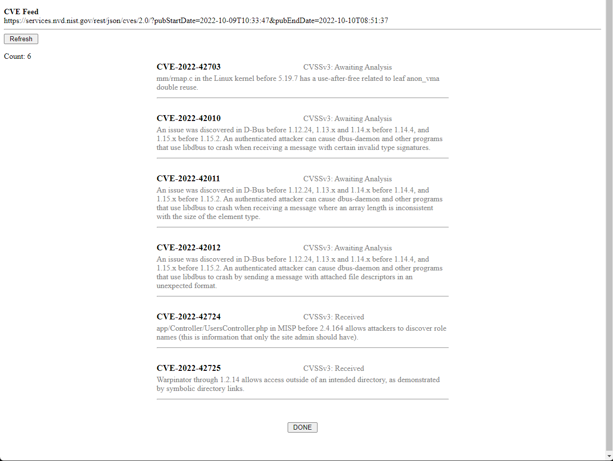

# Super Simple CVE Feed
Just a simple CVE Feed reader written in PHP. 

### Install

If your server supports PHP, just copy the files into a web directory, open in a browser.

### Reference
https://nvd.nist.gov/developers/vulnerabilities
